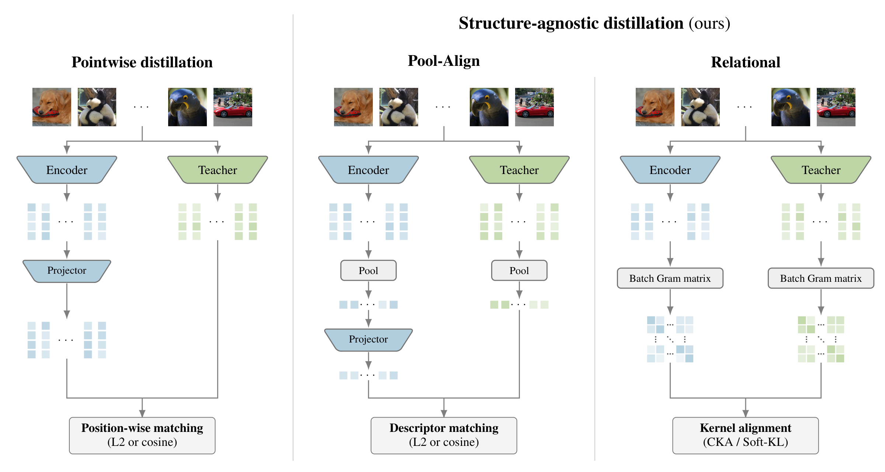

# Structure-Agnostic Distillation
### Diffusable Latents from Structure-Agnostic Distillation

[](https://arxiv.org/abs/2609.39657)
[](https://kyutai.org/blog/2026-09-28-structure-agnostic-distillation/)
[](LICENSE)

This repository contains the official implementation of **Diffusable Latents from
Structure-Agnostic Distillation** ([arXiv:2609.39657](https://arxiv.org/abs/2609.39657),
NeurIPS 2026 Workshop on Principles of Generative Modeling),
by Adrien Ramanana Rahary, Nicolas Dufour, Patrick Pérez and David Picard.

Distilling a pretrained encoder into an autoencoder makes its latent easier for a diffusion model
to learn. The usual recipe, VA-VAE's VF loss, matches every latent position to the co-located
teacher feature, so the latent has to share the teacher's patch grid. We match one pooled
descriptor per image instead, either directly (**Pool-Align**) or through the similarities
between the images of a batch (**CKA**, **Soft-KL**). Without the grid constraint, the same
objectives work for 2D-grid and 1D-sequence latents, and for image or text teachers.

The [blog post](https://kyutai.org/blog/2026-09-28-structure-agnostic-distillation/) walks through the idea and the results with interactive figures.



---

## 🗂️ Table of Contents
- [Installation](#-installation)
- [Data Preparation](#-data-preparation)
- [Training](#-training)
- [Evaluation](#-evaluation)
- [Results](#-results)
- [Repository Structure](#-repository-structure)
- [Acknowledgments and Citation](#-acknowledgments-and-citation)

---

## 🛠️ Installation

We use [`uv`](https://docs.astral.sh/uv/) to manage the Python environment and dependencies.

**1. Install `uv`:**
```sh
curl -LsSf https://astral.sh/uv/install.sh | sh
```

**2. Clone this repository and sync dependencies:**
```sh
git clone https://github.com/AdrienRR/structure-agnostic-distillation.git
cd structure-agnostic-distillation
uv sync
```
This installs Python 3.10 and the pinned dependencies from `uv.lock`, including PyTorch 2.2.0
built for CUDA 12.1, the versions used for the paper. Prefix all commands with `uv run`, and run
them from the repository root.

The teachers and the perceptual loss download their weights on first use: DINOv2 ViT-L/14
through timm, BGE-large through transformers, and VGG16 for LPIPS.

---

## 🧹 Data Preparation

**ImageNet.** The tokenizer uses the ImageNet loader from latent-diffusion. Point
`IMAGENET_ROOT` to a directory holding both splits, each with a `data/` folder of class
subdirectories:
```sh
export IMAGENET_ROOT=/PATH/TO/IMAGENET_LDM
mkdir -p $IMAGENET_ROOT/ILSVRC2012_train $IMAGENET_ROOT/ILSVRC2012_validation
ln -s /PATH/TO/IMAGENET/train $IMAGENET_ROOT/ILSVRC2012_train/data
ln -s /PATH/TO/IMAGENET/val   $IMAGENET_ROOT/ILSVRC2012_validation/data   # val sorted into class folders
```
The first run indexes each split, writing `filelist.txt` and a `.ready` marker, and downloads
three small class-name files.

**Captions (text teacher only).** The text teacher uses the captioned ImageNet of
[Degeorge et al. (2025)](https://arxiv.org/abs/2502.21318), hosted on the Hugging Face Hub at
[arijitghosh/T2I-ImageNet-Normal](https://huggingface.co/datasets/arijitghosh/T2I-ImageNet-Normal).
Its webdataset shards hold one caption per ImageNet training image, along with the images and
other features, so the full download is about 2.1 TB. Only the `.txt` captions are read.
```sh
uv run hf download arijitghosh/T2I-ImageNet-Normal --repo-type dataset --local-dir /PATH/TO/T2I_IMAGENET
```
Embed the captions once with BGE-large, then merge the per-rank files:
```sh
uv run torchrun --nproc_per_node 8 tools/precompute_text_embeddings_bge.py \
    --data /PATH/TO/T2I_IMAGENET --out /PATH/TO/BGE_LARGE
uv run python tools/precompute_text_embeddings_bge.py \
    --data /PATH/TO/T2I_IMAGENET --out /PATH/TO/BGE_LARGE --merge
export TEXT_EMB_ROOT=/PATH/TO/BGE_LARGE
```

**FID evaluator.** FID is computed with OpenAI's
[ADM evaluator](https://github.com/openai/guided-diffusion/tree/main/evaluations) against its
ImageNet 256×256 reference batch. The evaluator needs TensorFlow, so it gets its own environment:
```sh
mkdir -p evaluations
curl -L -o evaluations/evaluator.py \
    https://raw.githubusercontent.com/openai/guided-diffusion/main/evaluations/evaluator.py
curl -L -o evaluations/VIRTUAL_imagenet256_labeled.npz \
    https://openaipublic.blob.core.windows.net/diffusion/jul-2021/ref_batches/imagenet/256/VIRTUAL_imagenet256_labeled.npz
uv venv evaluations/.venv --python 3.10
uv pip install --python evaluations/.venv tensorflow==2.20.0 scipy requests tqdm
export ADM_PYTHON=$PWD/evaluations/.venv/bin/python
```
With the files in `evaluations/`, only `ADM_PYTHON` needs to be set. Otherwise, point
`ADM_EVALUATOR` and `FID_REF_NPZ` to them.

---

## 🏋️‍♂️ Training

The paper has 12 runs, named `{setting}_{method}`:

| Setting | Prefix | Latent | Teacher | Methods |
|---|---|---|---|---|
| A: shared grid | `2d` | 2D grid, 16×16×32 | DINOv2 ViT-L/14 | `none`, `vf`, `pool_align`, `cka`, `softkl` |
| B: no grid | `1d` | 1D sequence, 32×128 | DINOv2 ViT-L/14 | `none`, `pool_align`, `cka`, `softkl` |
| C: cross-modal | `text` | 2D grid, 16×16×32 | BGE-large (captions) | `pool_align`, `cka`, `softkl` |

Setting C shares `2d_none` as its undistilled baseline. Each run has one config per stage, in
`configs/tokenizer/`, `configs/tokenizer_inference/` and `configs/dit/`. A run trains in three
stages:
```sh
ARM=2d_pool_align
uv run bash scripts/1_train_tokenizer.sh $ARM                            # logs/$ARM/checkpoints/epoch=000049.ckpt
uv run bash scripts/2_extract_latents.sh $ARM /PATH/TO/IMAGENET/train    # latents/$ARM/imagenet_train_256/
uv run bash scripts/3_train_dit.sh $ARM                                  # output/$ARM/checkpoints/0080000.pt
```
1. **Tokenizer.** The autoencoder trains for 50 epochs at a global batch of 256, with the
   distillation term of the run. The configs assume 4 nodes of 8 GPUs. Launch the script once
   per node with `NNODES`, `NODE_RANK` and `MASTER_ADDR` set, or keep the global batch on a
   single node:
   ```sh
   uv run bash scripts/1_train_tokenizer.sh $ARM lightning.trainer.num_nodes=1 data.params.batch_size=32
   ```
2. **Latents.** The frozen tokenizer encodes ImageNet train and its horizontal flip.
3. **Diffusion prior.** LightningDiT-XL/1 trains for 80k steps at batch 1024 (64 epochs).

Stages 2 and 3 run on one 8-GPU node. Set `GPUS_PER_NODE` (stages 1 and 2) or `GPUS`
(stages 3 and 4) to use fewer GPUs.

---

## 📊 Evaluation

gFID uses 50k samples from 250 Euler steps, scored by the ADM evaluator. Evaluate the final
checkpoint without guidance:
```sh
uv run bash scripts/4_eval_gfid.sh $ARM                                  # output/$ARM/fid_curve.json
```
`LAST_N=16 STRIDE=3 uv run bash scripts/4_eval_gfid.sh $ARM` evaluates every 15k steps
instead, as in the convergence curves of the paper.

**Guided FID (setting A).** Pass the run's guidance scale, 13 for Pool-Align and 8 for VF:
```sh
uv run python compute_fid_curve.py --config configs/dit/2d_pool_align.yaml --cfg_scale 13 --per_proc_batch_size 256
uv run python compute_fid_curve.py --config configs/dit/2d_vf.yaml --cfg_scale 8 --per_proc_batch_size 256
```
Results go to `output/$ARM/fid_cfg<scale>.json`. Guidance runs the conditional and
unconditional branches in one batch, so the per-GPU batch is halved to fit in 80 GB. It follows
VA-VAE's recipe: interval guidance from 0.11 of the trajectory onwards, a timestep shift of 0.3,
and guidance on the first three latent channels only. That last choice is tuned for the 2D image
latent, so the paper reports guided FID for setting A only.

---

## 📈 Results

gFID on ImageNet 256×256 (50k samples, no guidance):

| Setting | None | VF | Pool-Align | CKA | Soft-KL |
|---|---|---|---|---|---|
| A: shared grid | 9.52 | 6.04 | **5.77** | 7.06 | 6.51 |
| B: no grid | 26.49 | – | **15.62** | 18.13 | 17.87 |
| C: cross-modal | 9.52 | – | **6.97** | 10.41 | 8.51 |

VF needs a teacher feature map on the latent's grid, so it only applies to setting A. With
guidance, Pool-Align reaches 1.99 on setting A and VF reaches 2.12, against 2.11 reported by
VA-VAE for the same training budget.

---

## 📁 Repository Structure

| Path | Contents |
|---|---|
| `vavae/ldm/modules/losses/contperceptual.py` | Tokenizer loss: L1 + LPIPS, KL, PatchGAN, VF, Pool-Align, gradient-norm balancing of the distillation term |
| `vavae/ldm/modules/losses/cka.py` | CKA and Soft-KL, with their cross-GPU gathers |
| `vavae/ldm/models/autoencoder.py` | VA-VAE KL autoencoder, the image and text teachers, and the Pool-Align projector |
| `vavae/ldm/models/conv_token_pool_autoencoder.py` | 1D tokenizer: the same encoder and decoder around a 32-token resampler bottleneck |
| `vavae/main.py` | Tokenizer training (PyTorch Lightning) |
| `tokenizer/vavae.py` | Frozen tokenizer used for latent extraction and decoding |
| `extract_features.py` | Latent extraction |
| `models/`, `transport/` | LightningDiT and its flow-matching ODE sampler, extended to 1D token inputs |
| `train.py`, `inference.py`, `compute_fid_curve.py` | DiT training, sampling and gFID |
| `tools/` | Caption embedding, and sample packing for the evaluator |

---

## 🤝 Acknowledgments and Citation

This code builds on:
* [VA-VAE / LightningDiT](https://github.com/hustvl/LightningDiT)
* [latent-diffusion](https://github.com/CompVis/latent-diffusion) and [taming-transformers](https://github.com/CompVis/taming-transformers)
* [SiT](https://github.com/willisma/SiT)
* [DINOv2](https://github.com/facebookresearch/dinov2) and [BGE](https://huggingface.co/BAAI/bge-large-en-v1.5)
* The captioned ImageNet of [Degeorge et al. (2025)](https://arxiv.org/abs/2502.21318)
* The [guided-diffusion](https://github.com/openai/guided-diffusion) FID evaluator

If you find this work useful, please consider citing:

```bibtex
@misc{ramananarahary2026diffusable,
  title         = {Diffusable Latents from Structure-Agnostic Distillation},
  author        = {Adrien Ramanana Rahary and Nicolas Dufour and Patrick P{\'e}rez and David Picard},
  year          = {2026},
  eprint        = {2609.39657},
  archivePrefix = {arXiv},
  primaryClass  = {cs.CV},
  url           = {https://arxiv.org/abs/2609.39657},
  note          = {NeurIPS 2026 Workshop on Principles of Generative Modeling (PriGM)}
}
```

The code is released under the [MIT License](LICENSE). Code adapted from other projects keeps
its original license, listed at the end of `LICENSE`.
